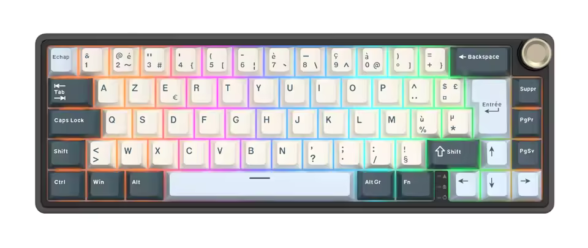

# Royal Kludge R65 ISO *(filaire uniquement)*


>[!IMPORTANT]  
>⚠️ Ces fichiers concernent uniquement la version **ISO** filaire du clavier **Royal Kludge R65**. Ces fichiers **NE DOIVENT PAS** être utilisé avec la version sans fil de ce même claiver.
>🛑 Il s'agit d'un firmware modifié qui pourrait endomagé votre clavier. À utiliser à votre propre risque.
>📜 **LISEZ LE [DISCLAIMER](DISCLAIMER-ENG.md)** fourni par @NieblaDev que je n'ai pas encore traduit. Il contient des informations importantes utiles avant d'utiliser les fichiers de ce dépôt.

## Description 🖋️  
⌨️ Le clavier **Royal Kludge R65** est un clavier à **65 %** avec un **gasket-mount** et une **molette de volume**. J'ai acheté la version **ISO French** avec des **Switchs RK marrons** » sur Aliexpress. Ce clavier est très bon selon moi, avec un prix attractif. Il est compatible VIA mais j'ai eu des difficultés à trouver le bon fichier JSON de configuration. J'ai échangé avec le support de la marque par mail et ils m'ont fourni le bon fichier *(très professionnel !* 😁 *)*. J'ai finalement décidé d'utiliser un firmware **QMK** à la place d'utiliser VIA pour passer outre certaines limitations de ce dernier. 

📂 La plupart des fichiers de ce dépôt proviennent du travail de *[NieblaDev](https://github.com/NieblaDev/R65-ISO-VIA)* qui s'est lui-même inspiré des travaux de *[sdk66](https://github.com/sdk66), [irfanjmdn](https://github.com/irfanjmdn), et [iamdanielv](https://github.com/iamdanielv)*. Ces codes sont ou seront correctement **crédités** *(travail toujours en cours !!!)*.

✨ N'hésitez pas à consulter leurs projets pour en savoir plus sur leur travail ! 💡 [^1][^2][^3][^4]

🛠️ Avant d'utiliser le dépôt de @NieblaDev, j'ai eu plusieurs déconvennues concernant le mappage des Leds.

📄 Le fichier *[keymap.c](rk/r65/keymaps/azerty_fr/keymap.c)* a été considérablement modifié. Dans ce fichier, @NieblaDev a adapté la présentation à la norme ISO et les erreurs fixes liées au mappage des clés. J'ai ajouté quelques modifications pour correspondre à un clavier **ISO FR** et l'adapter à mes besoins.

✨ J'espère que cela pourra vous être utile ! 💡  

## Guide

### > 🏗 Construire le Firmware

1. **Installer QMK MSYS**  
   Télécharger et installer [QMK MSYS](https://msys.qmk.fm).

2. **Configurer QMK MSYS**  
   Ouvrer QMK MSYS et lancer la commande :  
   ```bash
   qmk setup
   ```
   Un dossier sera créé à l'emplacement suivant : `C:/Users/%USERNAME%/qmk_firmware` ou `$HOME/qmk_firmware` par défaut.

3. **Ajouter les fichiers**
   Télécharger ce dépôt et déplacer le dossier `rk/r65` dans le dossier `qmk_firmware/keyboards/`.
   *Attention r65 en minuscule !*

5. **Compiler le firmware**  
   Exécuter la commande suivante de puis le dossier de QMK MSYS :  
   ```bash
   qmk compile -kb rk/r65 -km azerty_fr
   ```  
   *Seulement en version ISO.*

6. **Localiser les fichiers du firmware**  
   Trouvez le fichier compilé `.bin` ou `.hex` à la racine du dossier `qmk_firmware`.

### > ⚡ Flasher/Installer le Firmware
## 1) Méthode en ligne de commandes

1. **Entrer en mode Bootloader**
   Maintenez la touche Échap en branchant le câble USB. **Cela efface aussi les paramètres**.
   *D'autres méthodes sont possibles sur un clavier d'origine mais je ne l'ai pas conservé dans ce firmware.*

2. **Flasher le firmware**
   ```bash
   qmk flash -kb rk/r65/ -km azerty_fr
   ```
   
## 2) Méthode avec QMK Tookbox *(non testé)*

1. **Installer QMK Toolbox**  
   Télécharger et installer [QMK Toolbox](https://github.com/qmk/qmk_toolbox/releases).

2. **Charger le fichier firmware**  
   Ouvrer QMK Toolbox et charger le fichier `.bin` ou `.hex`.

3. **Entrer en mode Bootloader**  
   Passez le clavier en mode bootloader.

4. **Flasher le firmware**  
   Cliquez sur « Flash », puis sur « Exit DFU » une fois le flash terminé.

### > 🔓 Entrer en mode Bootloader
   Maintenez la touche Échap en branchant le câble USB. **Cela efface aussi les paramètres.**
   *D'autres méthodes sont possibles sur un clavier d'origine mais je ne l'ai pas conservé dans ce firmware.*


## Guide des combinaisons de touches et fonctions  
Ce guide est basé sur un clavier comme celui illustré ci-dessus.

| Catégorie             | Touches               | Fonction                                       |
|----------------------|--------------------|------------------------------------------------|
| 🔴🟢🔵 **Éclairage RGB**  | `Fn+ù`             | Cycle entres les modes RGB sens inversé             |
|                      | `Fn+*`             | Cycle entres les modes RGB sens normal              |
|                      | `Fn+s`             | Changer la teinte (HUE) RGB (couleurs) sens inversé |
|                      | `Fn+q`             | Changer la teinte (HUE) RGB (couleurs) sens normal  |
|                      | `Fn+w`             | Ralentir les animations RGB                    |
|                      | `Fn+x`             | Accéler les animations RGB                     |
|                      | `Fn+flêche haut`      | Augmenter la luminosité RGB                    |
|                      | `Fn+flêche bas`    | Diminuer la luminosité RGB                     |
|                      | `Fn+flêche droite`   | Augmenter la saturation RGB                    |
|                      | `Fn+flêche gauche`    | Diminuer la saturation RGB                     |
|                      | `Fn+Echap`           | Allumer/Éteindre l’éclairage RGB               |
| 🔢 **Touches de fonction**  | `Fn+1`             | F1                                             |
|                      | `Fn+2`             | F2                                             |
|                      | `Fn+3`             | F3                                             |
|                      | `Fn+4`             | F4                                             |
|                      | `Fn+5`             | F5                                             |
|                      | `Fn+6`             | F6                                             |
|                      | `Fn+7`             | F7                                             |
|                      | `Fn+8`             | F8                                             |
|                      | `Fn+9`             | F9                                             |
|                      | `Fn+0`             | F10                                            |
|                      | `Fn+)`             | F11                                            |
|                      | `Fn+=`             | F12                                            |
|                      | `Alt+2`            | Alt+F2                                         |
|                      | `Alt+4`            | Alt+F4                                         |
| ⌨️ **Touches système**    | `Fn+PgUp`            | Touche accueil / début                       |
|                      | `Fn+PgDn`          | Touche Fin                                     |
|                      | `Fn+backspace`    | Touche impression écran                         |
|                      | `Fn+Suppr`           | Insert key                                |
|                      | `Fn+Windows`       | Activer/Désactiver le verrou Windows           |
|                      | `Fn+^`             | Pause                                          |
|                      | `Fn+$`             | Scroll Lock / arrêt défil                      |
| ▶️⏸️ **Multimédia**    | `Fn+Appui molette`  | Play / Pause                                    |
|                      | `Fn+molette`       | Piste précédente/suivante                      |


[^1]: @irfanjmdn 's & @iamdanielv 's original ANSI rk65 project [HERE](https://github.com/irfanjmdn/r65/tree/master) with support for VIA, Vial, SignaRGB, SnapTap!.
[^2]: @sdk66 ’s QMK Firmware Repo, [HERE](https://github.com/hangshengkeji/qmk_firmware/tree/master/keyboards/rk).
[^3]: @iamdanielv 's customized firmware for the ANSI r65 [HERE](https://github.com/iamdanielv/kb_rk_r65)
[^4]: @NieblaDev's QMK ISO Firmware Repo [HERE](https://github.com/NieblaDev/R65-ISO-VIA)
